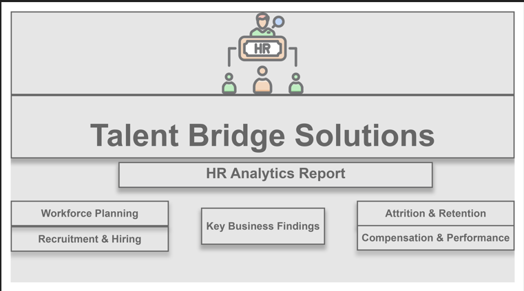
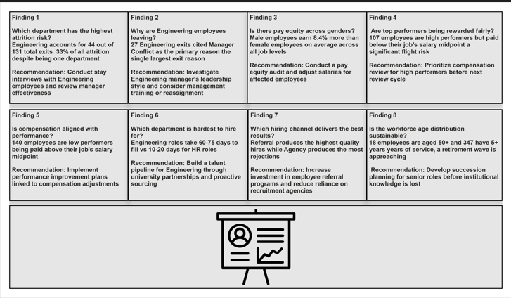
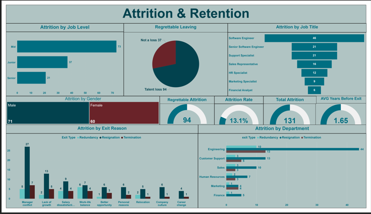
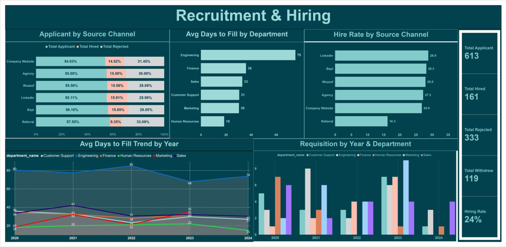
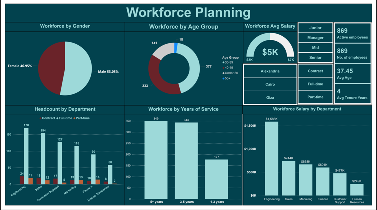
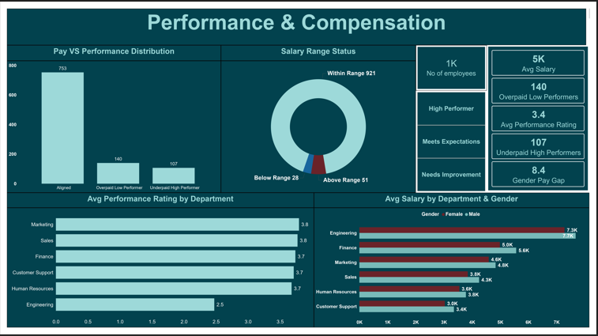

# HR Analytics — MySQL & Power BI

An end-to-end HR analytics project built from scratch using MySQL and Power BI. The project simulates a real company (TalentBridge Solutions) with 1,000 employees and 5 years of historical data, designed to surface real-world HR problems and present data-driven recommendations.

---

## Project Overview

| Item | Detail |
|---|---|
| Company | TalentBridge Solutions (fictional) |
| Employees | 1,000 |
| Time Period | 2020 – 2024 |
| Total Records | ~5,800 rows across 8 tables |
| Database | MySQL 8.0 |
| Visualization | Microsoft Power BI |
| Data Generation | Python (Faker library) |

---

## Dashboards

### Cover Page


### Business Findings
8 key HR findings with questions, data answers, and actionable recommendations.



### 1. Attrition & Retention


**Key metrics:** Total attrition · Attrition rate · Regrettable attrition · Avg years before exit

**Key finding:** Engineering accounts for 44 out of 131 total exits (33% of all attrition). Manager conflict is the top exit reason with 27 exits citing it directly.

---

### 2. Recruitment & Hiring


**Key metrics:** Avg days to fill · Overall hire rate · Open requisitions · Total applicants

**Key finding:** Engineering roles take 75 days to fill vs 19 days for HR roles. Agency channel has the lowest hire rate while Referral produces the highest quality hires.

---

### 3. Workforce Planning


**Key metrics:** Active headcount · Avg age · Avg tenure · Salary by department

**Key finding:** 347 employees have 5+ years of service and 18 are aged 50+, signaling an approaching retirement wave that requires succession planning.

---

### 4. Performance & Compensation


**Key metrics:** Avg salary · Gender pay gap · Underpaid high performers · Pay vs performance distribution

**Key finding:** An 8.4% gender pay gap exists across all job levels. 107 high performers are paid below their salary midpoint — a significant flight risk. Engineering has the lowest avg performance rating (2.5) driven by a single manager.

---

## Database Schema

8 interconnected tables covering the full employee lifecycle:

```
departments → jobs → employees → salaries
                              → performance_reviews
                              → attrition
                              → recruitment → candidates
```

### Tables

| Table | Rows | Description |
|---|---|---|
| `departments` | 6 | Department list with locations |
| `jobs` | 12 | Job titles with salary ranges |
| `employees` | 1,000 | Core employee records |
| `salaries` | 1,458 | Salary history per employee |
| `performance_reviews` | 3,386 | Annual performance ratings |
| `attrition` | 131 | Exit records with reasons |
| `recruitment` | 130 | Job requisitions |
| `candidates` | 675 | Applicant pipeline data |

---

## Analytical Views

4 SQL views power the Power BI dashboards directly:

| View | Purpose |
|---|---|
| `vw_attrition_analysis` | Full employee + exit data for attrition analysis |
| `vw_recruitment_funnel` | Requisitions + candidates + hiring metrics |
| `vw_workforce_overview` | Active workforce snapshot with age and tenure bands |
| `vw_compensation_performance` | Salary vs performance with pay equity flags |

---

## Real-World Problems Simulated

This dataset was deliberately designed to simulate 8 real HR problems:

1. **High attrition in Engineering** — 22% attrition rate vs ~8% in other departments
2. **Manager-driven turnover** — One Engineering manager's team cites conflict as top exit reason
3. **Gender pay gap** — Female employees earn 8.4% less on average across all job levels
4. **Underpaid high performers** — 107 employees rated as high performers paid below salary midpoint
5. **Overpaid low performers** — 140 low performers paid above salary midpoint
6. **Long time-to-fill in Engineering** — 75 avg days vs 19 days for HR roles
7. **Source channel performance gap** — Agency channel has lowest hire rate
8. **Retirement wave approaching** — 347 employees with 5+ years tenure and 18 aged 50+

---

## Project Structure

```
HR-Analytics-MySQL-PowerBI/
│
├── database/
│   ├── hr_analytics_schema.sql       ← CREATE TABLE statements
│   ├── hr_analytics_data.sql         ← INSERT data (5,800+ rows)
│   └── hr_analytics_views.sql        ← 4 analytical views
│
├── powerbi/
│   └── TalentBridge_HR_Analytics.pbix
│
├── python/
│   └── generate_hr_data.py           ← Data generation script
│
├── screenshots/
│   ├── cover_page.png
│   ├── business_findings.png
│   ├── attrition_dashboard.png
│   ├── recruitment_dashboard.png
│   ├── workforce_dashboard.png
│   └── compensation_dashboard.png
│
└── README.md
```

---

## How to Run This Project

### 1. Set up the database
```sql
-- Run in order:
-- 1. hr_analytics_schema.sql   (creates tables)
-- 2. hr_analytics_data.sql     (inserts data)
-- 3. hr_analytics_views.sql    (creates views)
```

### 2. Connect Power BI
- Open `TalentBridge_HR_Analytics.pbix`
- Go to **Home → Transform data → Data source settings**
- Update the MySQL server to `localhost` and database to `hr_analytics`
- Click **Refresh**

### 3. Regenerate data (optional)
```bash
pip install faker
python python/generate_hr_data.py
```

---

## Tools & Technologies

| Tool | Purpose |
|---|---|
| MySQL 8.0 | Database design and querying |
| Power BI Desktop | Dashboard and visualization |
| Python 3 + Faker | Realistic data generation |
| DAX | Power BI measures and calculations |
| SQL Views | Data transformation layer |

---

## Key DAX Measures

```dax
Attrition Rate % = 
DIVIDE([Total Attrition], COUNTROWS('Attrition analysis'), 0) * 100

Gender Pay Gap % = 
VAR male_avg = CALCULATE(AVERAGE('Compensation performance'[current_salary]), 
               'Compensation performance'[gender] = "Male")
VAR female_avg = CALCULATE(AVERAGE('Compensation performance'[current_salary]), 
                'Compensation performance'[gender] = "Female")
RETURN ROUND(DIVIDE(male_avg - female_avg, male_avg, 0) * 100, 1)

Underpaid High Performers = 
CALCULATE(COUNTROWS('Compensation performance'),
'Compensation performance'[pay_performance_flag] = "Underpaid High Performer")
```

---

## Author

**Mohamed Khaled**
HR Specialist & Data Analyst

[](https://linkedin.com/in/mohamedkhaled18/)
[](https://github.com/MohamedBakr180)

---

## License

This project is open source and available under the [MIT License](LICENSE).
